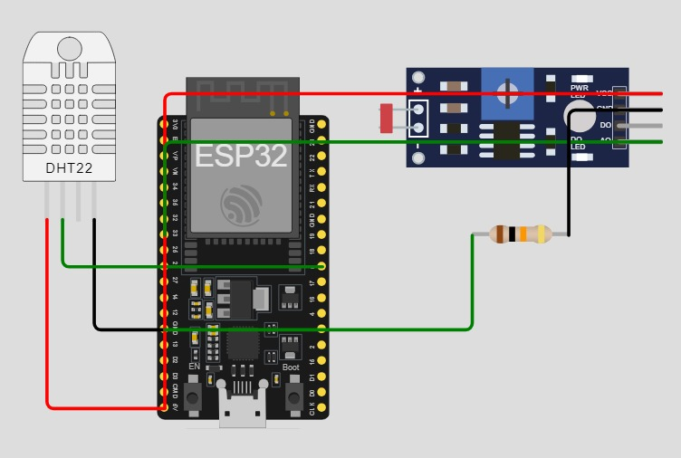

# Temperatura, umidade e intensidade de luz em um broker MQTT

Este projeto demonstra como conectar um ESP32 a uma rede Wi-Fi e publicar dados de sensores (temperatura, umidade e intensidade de luz) em um broker MQTT.

## Requisitos

- Placa de desenvolvimento ESP32
- Sensor de temperatura e umidade DHT11
- Sensor de luz analógico (por exemplo, LDR)
- IDE Arduino com as seguintes bibliotecas:
  - `WiFi`
  - `PubSubClient`
  - `DHT`

## Configuração de Hardware

1. Conecte o sensor DHT11 ao pino GPIO 5:
   - VCC ao 3.3V
   - GND ao GND
   - Dados ao GPIO 5

2. Conecte o sensor de luz analógico ao pino GPIO 33:
   - VCC ao 3.3V
   - GND ao GND
   - Saída ao GPIO 33

## Configuração

- Atualize as seguintes variáveis no código:
  - `ssid`: Nome da sua rede Wi-Fi.
  - `password`: Senha da sua rede Wi-Fi.
  - `IP_MQTT`: O endereço IP do seu broker MQTT.

## Visão Geral do Código

1. **Conexão Wi-Fi**: A função `connectWiFi()` gerencia a conexão com a rede Wi-Fi especificada.

2. **Cliente MQTT**: O `PubSubClient` é configurado para conectar ao broker MQTT no endereço IP especificado.

3. **Leitura dos Sensores**: A função `loop()` lê continuamente dados do sensor DHT11 e do sensor de luz analógico e publica esses dados no broker MQTT.

4. **Publicação de Dados**: Os dados são publicados nos seguintes tópicos MQTT:
   - `/TEF/device005/attrs/temperatura`
   - `/TEF/device005/attrs/umidade`
   - `/TEF/device005/attrs/luminosidade`

## Uso

1. Faça o upload do código para o seu ESP32 usando a IDE Arduino.
2. Abra o Monitor Serial para ver o status da conexão e as leituras dos sensores.
3. Use um cliente MQTT (como MQTT.fx ou Mosquitto) para se inscrever nos tópicos publicados e visualizar os dados.

## Nota

Certifique-se de que o seu broker MQTT seja acessível a partir da rede do ESP32 e que quaisquer regras necessárias de encaminhamento de porta ou firewall estejam configuradas.

## Integrantes do Grupo
- Gustavo Henrique – 556712 
- Milena Garcia – 555111 
- Steffany Medeiros – 556262
- Vinicius Henrique - 556908

